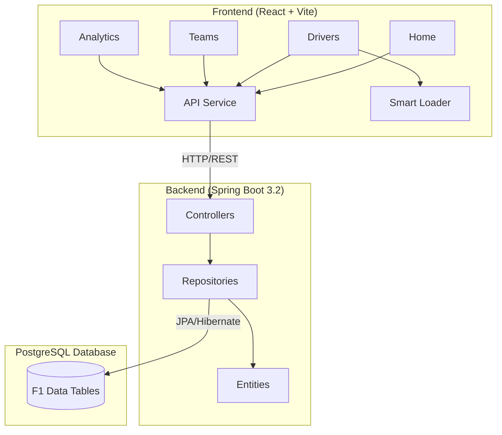
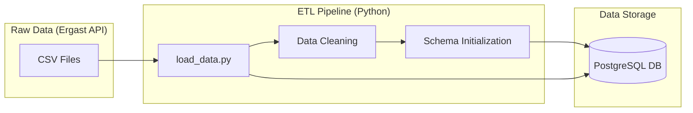

# 🏎️ Race Control

> The ultimate historic database of Formula 1 — A full-stack, data-driven F1 history & analytics platform.

Race Control is an immersive, data-rich application designed to visualize the complete history of Formula 1. It features **driver archives**, **constructor profiles**, **race calendars**, **advanced analytics**, **ML predictions**, and stunning 8-bit driver portraits, all wrapped in a broadcast-quality racing aesthetic with immersive sound effects.


---

## 🎨 Design Philosophy

This project embraces a cohesive **motorsport identity** inspired by F1 broadcast graphics:

- **F1 Red (`#E10600`)** & **Racing Black (`#0B0B0B`)** — Primary color palette
- **Typography:** Racing-inspired fonts with monospace data displays
- **Racing Elements:** Checkered flags, racing stripes, speed lines, and tyre animations
- **8-Bit Portraits:** Unique pixel-art driver portraits generated with AI
- **Immersive SFX:** Engine revs, pit clicks, gear shifts, and crowd cheers

---

## 🏗️ Architecture



### Data Pipeline



### Tech Stack

| Layer | Technology | Purpose |
|-------|------------|---------|
| **Frontend** | React 19 + Vite | SPA with racing UI & Framer Motion animations |
| **Styling** | Tailwind CSS | Utility-first CSS with custom F1 theme |
| **Audio** | Howler.js + Zustand | Immersive racing sound effects |
| **Charts** | Recharts | Analytics visualizations |
| **Backend** | Spring Boot 3.2 | RESTful API with analytics endpoints |
| **ORM** | Hibernate/JPA | Object-relational mapping |
| **Database** | PostgreSQL 16 | Relational data storage |
| **ETL** | Python + Pandas | Data loading from Ergast CSV |

---

## 📁 Project Structure

```
formula-legacy/
├── .github/workflows/       # CI/CD pipeline
│   └── ci.yml
├── backend/                 # Spring Boot backend
│   ├── src/main/java/com/f1pedia/
│   │   ├── controller/      # REST API endpoints
│   │   ├── domain/          # JPA entities
│   │   └── repository/      # Data access layer
│   └── pom.xml
├── frontend/                # React frontend
│   ├── public/
│   │   ├── audio/           # Racing SFX files
│   │   └── logo.png
│   ├── src/
│   │   ├── components/      # Reusable UI components
│   │   ├── pages/           # Route pages
│   │   ├── services/        # API layer
│   │   └── utils/           # Audio manager, helpers
│   └── package.json
├── etl/                     # Data pipeline
│   ├── schema.sql           # Database schema
│   ├── load_data.py         # ETL script
│   └── requirements.txt
├── ml/                      # Machine Learning (Offline Analysis)
│   ├── feature_engineering.py
│   ├── train_race_predictor.py
│   ├── train_points_predictor.py
│   └── models/              # Trained ONNX models
├── assets/                  # Media assets
│   ├── *_8bit.png           # 8-bit driver portraits
│   ├── generate_sfx.py      # SFX generator
│   └── drivers.md           # Portrait tracking
└── data/                    # Ergast F1 CSV data
```

---

## ✨ Features

### 🏠 Premium Homepage
- F1 start lights loading animation
- 75 years of racing history timeline
- All-time records section
- Champions podium display
- Horizontal scroll showcase

### 👨‍✈️ Driver Archive
- 860+ F1 drivers from 1950-2024
- Legends vs Current Era tabs
- AI-generated 8-bit pixel art portraits
- Career statistics & team history

### 🏆 Constructor Profiles
- 210+ F1 constructors
- Team driver history with detailed stats
- Points, wins, podiums breakdown
- Racing stripe accents

### 📅 Race Calendar
- Season-by-season race schedules
- 75 years of F1 history (1950-2024)
- Links to full race reports

### 🏁 Circuit Archive
- All F1 circuits with statistics
- First/last race years
- Total races hosted

### 📊 Advanced Analytics
- Qualifying progression analysis
- Race pace & grid performance
- Championship battle tracking
- Teammate head-to-head battles
- DNF cause analysis
- Pit stop efficiency rankings
- **Circuit Risk/Reliability Analysis**: Detailed stats on high-risk circuits and DNF rates

### 🧩 Smart Loader
- Context-aware loading screens
- Displays interesting F1 facts while fetching data
- Eliminates perceived latency on heavy data pages

### 📈 Predictive Analytics
- Race outcome probabilities based on historical data
- Points likelihood scoring
- Statistical regression analysis

### 🔊 Immersive Audio
- F1 start lights countdown beeps
- Engine rev sounds
- Pit stop wheel gun clicks
- Gear shift blips
- Crowd cheers
- Mute toggle & volume control

---

## 🚀 Getting Started

### Prerequisites

- **Java 21** (for Spring Boot)
- **Node.js 20+** (for React)
- **PostgreSQL 16** (database)
- **Python 3.10+** (for ETL & ML)

### Quick Start with Docker

```bash
# Clone the repository
git clone https://github.com/adityasync/Formula-Legacy.git
cd Formula-Legacy

# Start with Docker Compose
docker compose up -d

# App runs on http://localhost:5173
```

### Manual Setup

#### 1. Database Setup

```bash
# Create database
createdb f1_db

# Run schema
psql -d f1_db -f etl/schema.sql
```

#### 2. Load Data (ETL)

```bash
cd etl
python -m venv venv
source venv/bin/activate
pip install -r requirements.txt
python load_data.py
```

#### 3. Start Backend

```bash
cd backend
./mvnw spring-boot:run
# API runs on http://localhost:8080
```

#### 4. Start Frontend

```bash
cd frontend
npm install
npm run dev
# App runs on http://localhost:5173
```

---


## 🔌 API Endpoints

### Core Endpoints
```
GET /api/drivers              # All drivers
GET /api/drivers/{id}         # Driver by ID
GET /api/drivers/{id}/stats   # Driver career stats
GET /api/constructors         # All constructors
GET /api/constructors/{id}    # Constructor by ID
GET /api/races?year={year}    # Races by season
GET /api/circuits             # All circuits with stats
```

### Analytics Endpoints
```
GET /api/analytics/qualifying-progression?season={year}
GET /api/analytics/grid-performance?season={year}
GET /api/analytics/pole-to-win
GET /api/analytics/fastest-laps?season={year}
GET /api/analytics/teammate-battles?season={year}
GET /api/analytics/dnf-causes
GET /api/analytics/pit-stop-efficiency?season={year}
GET /api/analytics/championship-battle?season={year}
GET /api/analytics/circuit-reliability
GET /api/analytics/driver-form
GET /api/analytics/season-dominance
```

---

## 🎵 Sound Effects

The app includes immersive racing SFX generated via audio synthesis:

| Sound | Trigger |
|-------|---------|
| `start_beep.wav` | Homepage loading (F1 start lights) |
| `engine_rev.wav` | Test button in audio settings |
| `pit_click.wav` | Available for interactions |
| `gear_shift.wav` | Navbar navigation clicks |
| `cheer.wav` | Available for celebrations |
| `click.wav` | Card/button clicks |
| `hover.wav` | Card hover effects |

Audio controls available in bottom-right corner (mute toggle + volume slider).

---

## 📄 License

This project is for educational and portfolio purposes. F1 data sourced from [Ergast Developer API](http://ergast.com/mrd/).

---

## 👤 Author

**Aditya Sync** - [GitHub](https://github.com/adityasync)

---

<p align="center">
  <strong>Race Control</strong> — Racing Through History 🏁
</p>
